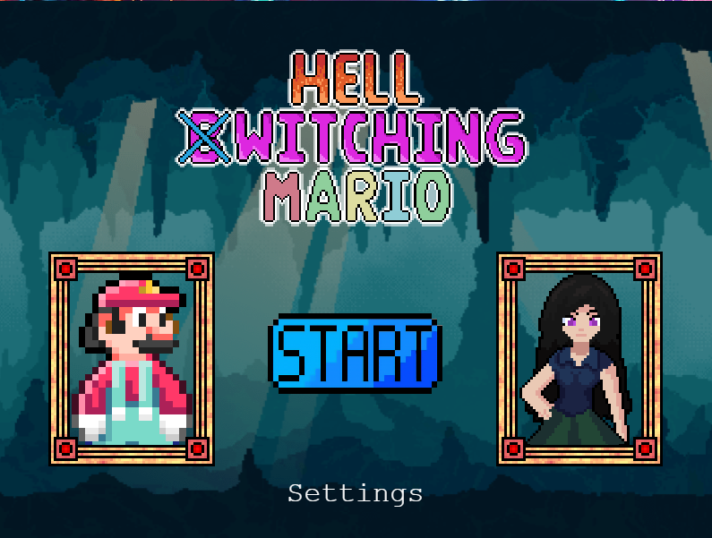
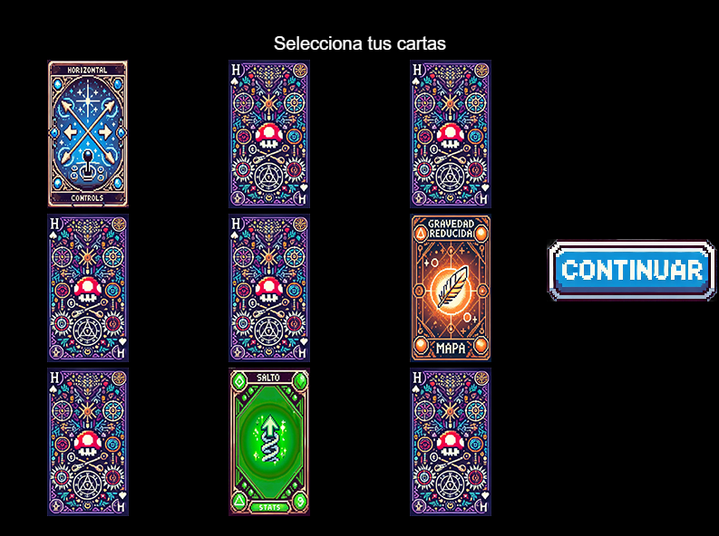
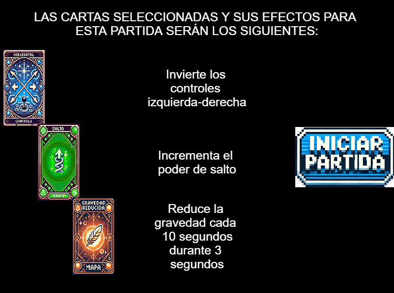
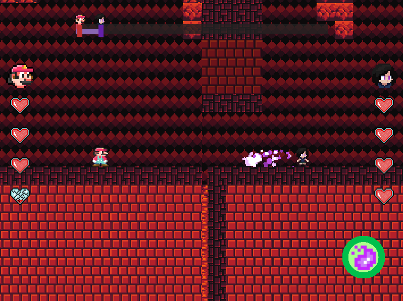

# Hell Witching Mario

## Descripción General

**Hell Witching Mario** es un emocionante juego de persecuciones entre Mario y Yennefer. Este proyecto combina elementos clásicos de plataformas con mecánicas nuevas basadas en cartas seleccionables que modifican la jugabilidad. Fue desarrollado como parte de un trabajo universitario, destacando por su enfoque creativo y diseño visual pixel art.

En el juego, los jugadores seleccionan **tres cartas** que afectan a diferentes aspectos del gameplay, incluyendo los controles, estadísticas de los personajes y las condiciones del mapa. El objetivo de Mario es alcanzar a Yennefer antes de que esta logre escapar del mapa.

---

## Características

- **Cartas seleccionables**: 9 cartas divididas en tres categorías (Controles, Estadísticas y Modificaciones del Mapa).
- **Personajes jugables**:
  - **Mario**: Usa las teclas WASD para moverse, saltar y activar habilidades.
  - **Yennefer**: Usa las flechas del teclado para moverse y activar sus habilidades.
- **Efectos únicos**:
  -          CONTROLES:
o   Invertidos Horizontal: cambian los controles de derecha izquierda durante la partida.
o   Invertidos Vertical: cambian los controles de salto y power up durante la partida.
o   Deslizamiento: el jugador tendrá un pequeño deslizamiento al intentar frenar
 
-          STATS:
o   Vida: Se aumenta la cantidad de vida de los jugadores.
o   Velocidad: Se aumenta la velocidad de los jugadores.
o   Salto: Se aumenta la potencia de salto de los jugadores.
 
-          MAPA:
o   Gravedad reducida: Cada 10 segundos la gravedad disminuye en el mapa.
o   Glitch: Ambos jugadores se verán desplazados en una dirección aleatoria en intervalos aleatorios de tiempo durante la partida y su animación cambiará.
o   Relámpago: Durante la partida se dificultará la visión de los jugadores con un efecto de relámpago cada 6-10 segundos.

- **Arte en pixel art** y ambientación de fantasía.

---

## Capturas del Juego

### Pantalla principal

### Selección de cartas

### Resumen

### Gameplay

---

## Trabajo Universitario

Este proyecto fue desarrollado como parte de un curso académico de diseño y desarrollo de videojuegos. Es un ejemplo práctico de cómo integrar mecánicas avanzadas como:
- Física personalizada con **Phaser.js**.
- Estilo visual basado en **pixel art**.
- Incorporación de elementos interactivos que alteran el juego.

---

## Redes Sociales 

Si has creado redes sociales para el proyecto, inclúyelas aquí:
- [Twitter](https://x.com/CShrimpStudios)
- [Instagram](https://instagram.com/cshrimpstudios)

---

## Enlace al Proyecto

Puedes jugar la versión pública del juego directamente en GitHub Pages:
[Hell Witching Mario - Publicación en GitHub Pages](https://codeshrimpstudios.github.io/)

---

## Créditos

- **Diseño y desarrollo**: [Davide Chen][Gabriel Barroso Bueno][Javier Muñoz Garcia][Sergio Croche Trigo]
- **Estudio**: CodeShrimpStudios

